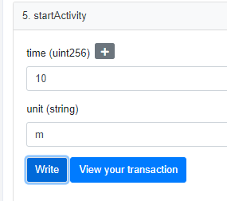
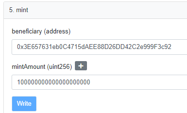
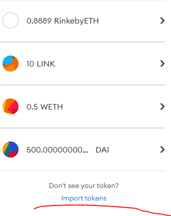
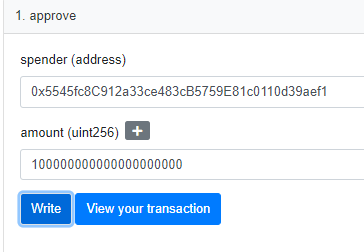
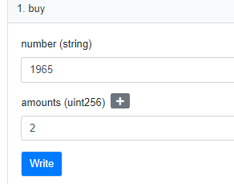
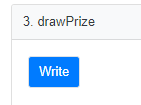
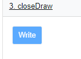
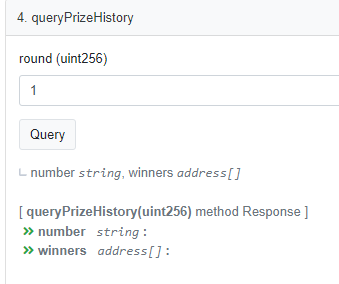

## 去中心化的彩票系统
### 要求
1. 具备管理员和参与者两种身份，管理员发起彩票活动，并设置彩票开奖时间，参与者在彩票发起⾄ 彩票开奖间可参与购买彩票。 

2. 每个参与者每次投资5DAI购买⼀注彩票，⼀个参与者可购买多注彩票。 
   
3. 彩票中奖数字由4位0-9之间的数字构成，中奖数字随机⽣成，中奖者按购买对应数字的注数平分彩票池，平台收取20%的⼿续费。 
   
4. 管理员可多次发起彩票活动，但是同⼀时间仅⽀持⼀个彩票活动存在。 5. 需提供接⼝查询往期彩票的中奖数字和中奖者。

### 注意
- 合约部署到rinkeby测试网，因为Chainlink不支持Ropsten测试网

### 下注模式?
- 简单的模式, 每下一注相当于购入一张抽奖券, 最后开奖的时候从所有玩家中随机抽出一位获奖者。
- 现实中的福利彩票, 彩民自己下注选号，每个号码可以购买多注，最后中奖的彩民可能有多个，也可能一个都没有, 当然这种情况可能性很小，一等奖还有可能落空，但是有二等奖 三等奖啊。不过对于本仓库的智能合约来说，只有一个总的奖池，不分等级, 而且样本数少的情况下，没人中奖的可能性还是很高的
  + 本合约遵循此模式
### 中奖号码
- 数字还是字符串?
  + 下注号码可以是0开头, 比如 0011 0130 等等，所以应该是字符串形式
### 开奖
- 本合约需要管理员手动开奖，如需实现定时开奖，参阅Chainlink文档
### 如何生成随机数?
- 任何链上的随机源都是不安全的，需要依赖外部未知的输入作为种子
- 本合约使用Chainlink VRF生成安全的随机数
  + 注意: 对于一个部署的Chainlink随机数合约第一次请求总是0, 节点需要时间达成共识, 从第二次开始正常返回
### 部署
- 确保电脑上装有nodejs和yarn
- 安装依赖 `yarn install`
- 填写环境变量
  - ```
    ALCHEMY_ROPSTEN_KEY = 

    // 必填
    ALCHEMY_RINKEBY_KEY = 

    // 必填: 部署账号的私钥
    PRIVATE_KEY = 

    // 必填
    ETHERSCAN_API_KEY = 

    // 不用填, 程序会自动填写
    VRF_CONTRACT_ADDRESS = 

    // 不用填, 程序会自动填写
    LOTTERY_CONTRACT_ADDRESS = 
    ```
- 部署到Rinkeby `yarn deploy:rinkeby`
- 验证源码 `yarn verify`
- **实例化VRF, 并且添加合约地址到Chainlink订阅列表**
  - 如果抽奖方法出错，请检查chainlink是否配置
### 测试
**所有示例都在 Rinkeby 测试网**
#### 水龙头
- Rinkeby ETH
  - faucet https://rinkebyfaucet.com/
- Rinkeby DAI
  - faucet 
    - 这是一个部署在Rinkeby上的自定义Token
    - 获取方法, 直接在etherscan上调用mint方法, 然后添加到Metamask的Token List
    - https://rinkeby.etherscan.io/address/0x5eD8BD53B0c3fa3dEaBd345430B1A3a6A4e8BD7C#writeContract
  - address 0x5eD8BD53B0c3fa3dEaBd345430B1A3a6A4e8BD7C
- 首先用户需要授权Approve一下合约允许消费对应数量的DAI Token, 然后合约中才能调用transferFrom方法
#### 测试demo
- 合约地址 
  - https://rinkeby.etherscan.io/address/0x6e41D8A812F95E60D5f78d2589C1666d9F51E87f#code
#### 开始一个活动
- 切换到管理员账号, 假设开始一个10分钟的活动
- 
### 下注
- 切换到非管理员账号
- 确保已经授权过合约
  - 获取100个 DAI TOKEN
    - https://rinkeby.etherscan.io/address/0x5eD8BD53B0c3fa3dEaBd345430B1A3a6A4e8BD7C#writeContract
    - 
  - 添加到Metamask
    - 
  - 模拟用户给合约授权100个DAI
    - https://rinkeby.etherscan.io/address/0x5eD8BD53B0c3fa3dEaBd345430B1A3a6A4e8BD7C#writeContract
    - 
- 购买2注 号码 "1965"
  - 
### 开奖
- 切换到管理员账号, 等到开奖时间
  - 
- 如果没有任何中奖人, 管理员可以反复开奖，直到产生中奖者
- 在没有中奖者情况下, 管理员可以手动关闭当前抽奖阶段, 以便开始一个新的活动
  - 
### 查询往期彩票的中奖数字和中奖者
- 填写期数round
  - 